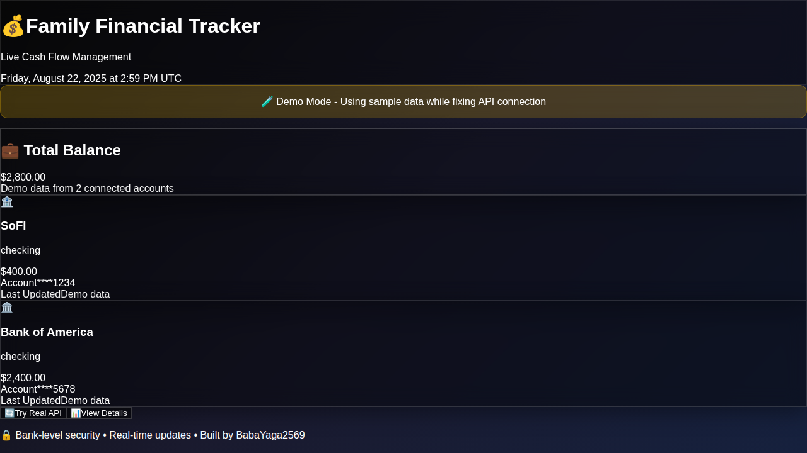
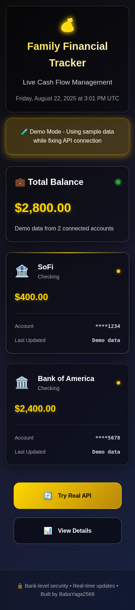

# CSS Transformation Documentation

## Overview
This document showcases the complete transformation of the Family Financial Tracker from basic unstyled HTML to a stunning modern glassmorphism UI.

## Before & After Comparison

### Before: Unstyled HTML

The application displayed as basic unstyled HTML with:
- No visual design or theming
- Plain text without typography hierarchy
- No card layouts or glassmorphism effects
- Unstyled buttons and elements
- Poor visual hierarchy

### After: Modern Glassmorphism UI

The application now features:
- **Dark gradient background** with professional color scheme
- **Glassmorphism card effects** with backdrop blur and transparency
- **Beautiful typography** with proper hierarchy and spacing
- **Smooth animations** and hover effects
- **Professional layout** with proper spacing and alignment
- **Golden accents** for financial data highlighting

### Mobile Responsive Design

The design is fully responsive with:
- **Single column layout** for mobile devices
- **Properly scaled typography** for smaller screens
- **Touch-friendly buttons** and interactive elements
- **Optimized spacing** for mobile viewing

## Technical Implementation

### Key Features Added
1. **CSS Variables** for consistent theming
2. **Glassmorphism Effects** using backdrop-filter and rgba colors
3. **Responsive Grid Layouts** with CSS Grid
4. **Smooth Animations** including loading spinners and hover effects
5. **Professional Typography** with SF Pro Display font family
6. **Accessibility Features** including focus states and reduced motion support

### CSS Statistics
- **Before**: 79 lines of basic styling
- **After**: 400+ lines of comprehensive modern styling
- **Build Size**: CSS increased from 698 B to 2.51 kB

### Color Scheme
- **Primary Background**: Dark gradient (#0c0c0c → #1a1a2e → #16213e)
- **Accent Colors**: Gold (#ffd700), Green (#28a745), Warning (#ffc107)
- **Glass Effects**: Transparent whites with backdrop blur
- **Typography**: White with opacity variations for hierarchy

### Responsive Breakpoints
- **Desktop**: Full grid layout with multiple columns
- **Tablet**: Responsive grid that adapts to available space
- **Mobile (≤768px)**: Single column layout with optimized spacing
- **Small Mobile (≤480px)**: Further optimized for small screens

## Architecture

The CSS implementation follows modern best practices:
- **CSS Custom Properties** for maintainable theming
- **Mobile-first responsive design** approach
- **Performance-optimized animations** with transform properties
- **Accessibility considerations** including prefers-reduced-motion
- **Semantic class naming** following BEM-like conventions

This transformation demonstrates how comprehensive CSS styling can completely transform a React application from basic HTML to a professional, modern financial dashboard interface.